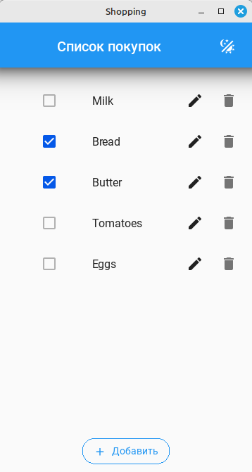
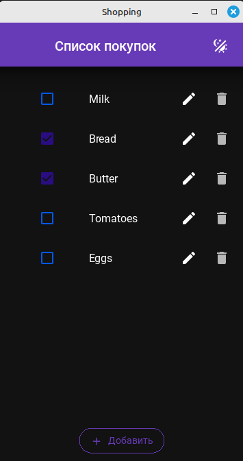

# Shop List

Приложение для ведения списка покупок на Python с использованием KivyMD и SQLite.

---

## Возможности

- Добавление, редактирование и удаление товаров
- Отметка товаров как купленных
- Смена темы (светлая/тёмная), запоминается между сессиями
- Хранение данных в SQLite
- Логирование действий в файл
- Чистая архитектура и покрытие тестами

---

## Установка

1. Клонируйте репозиторий:
    ```sh
    git clone <repo-url>
    cd shop_list
    ```

2. Установите зависимости:
    ```sh
    poetry install
    ```

3. (Опционально) Скопируйте `.env.example` в `.env` и настройте переменные окружения для базы данных.

---

## Запуск

```sh
poetry run python main.py
```

---

## Тесты

```sh
poetry run pytest
```

---

## Структура проекта

- `main.py` — основной файл приложения
- `src/shop_list/models/` — работа с базой данных и SQL-запросы
- `src/shop_list/utils/` — утилиты (работа с темой, SQL и др.)
- `src/shop_list/views/ui.kv` — описание интерфейса
- `tests/` — тесты

---

## Настройки

- Темы и палитры сохраняются в `settings.json` в корне проекта.
- SQL-запросы хранятся в `src/shop_list/models/qeuries.sql`.

---

## Скриншоты





---

## Лицензия

[MIT License](LICENSE)

---

**Автор:**  
ABlack, https://github.com/black40